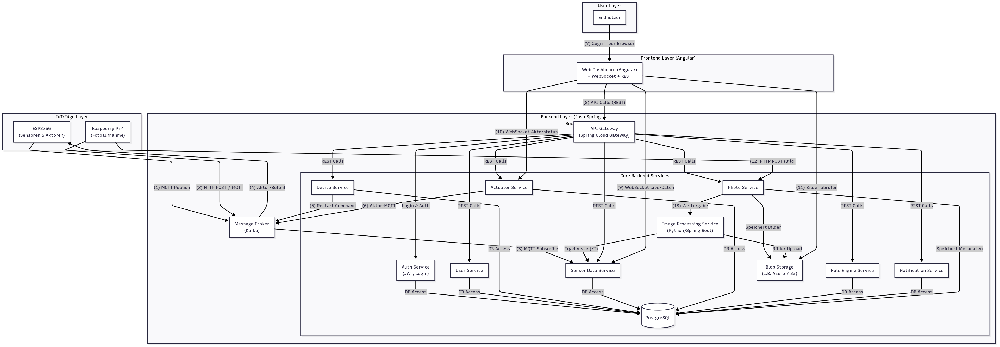

# Greenhouse Platform – Smart IoT Monitoring and Automation



## Overview

**Greenhouse** is an advanced IoT-based platform for monitoring and automating greenhouse environments. Leveraging a microservice architecture, the system integrates sensors, actuators, image processing, rule-based automation, and a modern web dashboard to enable efficient greenhouse management and optimal plant growth.

---

## Architecture

The platform is organized into several layers and services, each with a clear responsibility:

### 1. IoT/Edge Layer
- **ESP8266 (Sensoren & Aktoren):** Collects environmental data and controls actuators (e.g., fans, pumps).
- **Raspberry Pi 4 (Fotoaufnahme):** Captures images for plant health monitoring.

### 2. Messaging Layer
- **Message Broker (MQTT/RabbitMQ):** Reliable message exchange between IoT devices and backend microservices.

### 3. Backend/Core Services (Spring Boot/Java & Python)
- **Device Service:** Manages connected devices, issues restart commands, and interacts with actuators.
- **Actuator Service:** Receives commands and controls physical actuators.
- **Sensor Data Service:** Collects, processes, and stores sensor data.
- **Auth Service (JWT, Login):** Handles authentication and authorization.
- **User Service:** Manages user profiles and access.
- **Photo Service:** Handles image uploads, retrieval, and storage coordination.
- **Image Processing Service (Python/Spring Boot):** Analyzes images for plant health and other metrics using AI.
- **Rule Engine Service:** Applies automation rules based on sensor data and events.
- **Notification Service:** Sends alerts and notifications to users.

### 4. Data Storage
- **PostgreSQL:** Central relational database for structured data.
- **Blob Storage (Azure/S3):** Stores large files such as images.

### 5. API Gateway & Realtime Communication
- **API Gateway (Spring Cloud Gateway):** Single entry point for all backend services, handles REST and WebSocket traffic.
- **WebSocket:** Real-time live data updates and actuator status.

### 6. Frontend Layer
- **Web Dashboard (Angular):** User-facing dashboard for monitoring and controlling greenhouse operations, with REST and WebSocket integration.

### 7. User Layer
- **End User:** Interacts with the system via the web dashboard.

---

## Key Features

- **Real-time Monitoring:** Live sensor values, actuator statuses, and image feeds.
- **Automation:** Custom rules to automate climate control, irrigation, and more.
- **Image Analysis:** AI-driven health assessment and anomaly detection for plants.
- **Notifications:** Alerts for critical events (e.g., temperature thresholds, device failures).
- **Secure Access:** Role-based authentication and authorization (JWT).
- **Modular Microservices:** Each core function resides in its own service for scalability and maintainability.

---

## Data Flow Example

1. **Sensor/Camera Data:**
    - ESP8266 & Raspberry Pi send data/images via MQTT/HTTP.
2. **Backend Processing:**
    - Sensor Data Service stores data in PostgreSQL.
    - Photo Service stores images in Blob Storage and triggers Image Processing.
3. **Rule Evaluation & Automation:**
    - Rule Engine Service evaluates conditions and triggers actuators via Device/Actuator Services.
4. **User Interaction:**
    - Users view data, images, and receive notifications through the Angular dashboard.

---

## Getting Started

1. **Clone the repository**
    ```bash
    git clone https://github.com/Mamali99/greenhouse.git
    ```

2. **Deploy Services**
    - Use Docker Compose or Kubernetes for deploying all microservices and dependencies (PostgreSQL, MQTT broker, Blob Storage emulator).
    - See each service's directory for build and run instructions.

3. **Run Frontend**
    - Navigate to the frontend directory and start the Angular app.
    - Access the web dashboard through your browser.

---

## Contributing

We welcome contributions! Please open issues or pull requests for new features, bug fixes, or documentation improvements.

---

## Diagram Reference

The architecture diagram above illustrates the flow and interaction of all system components.
